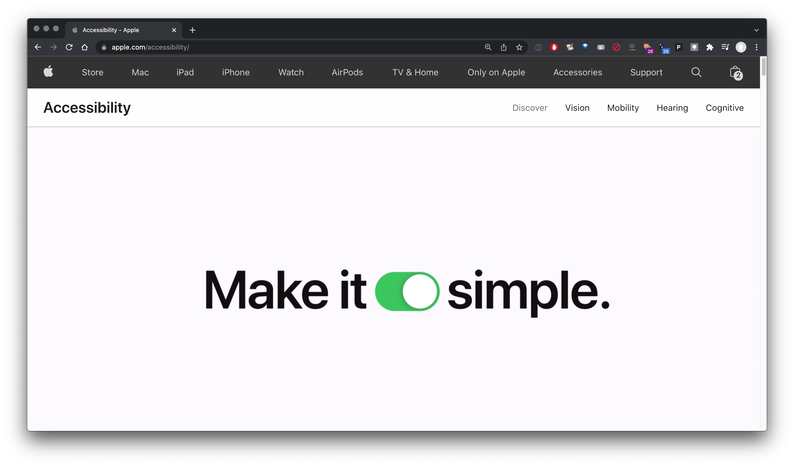
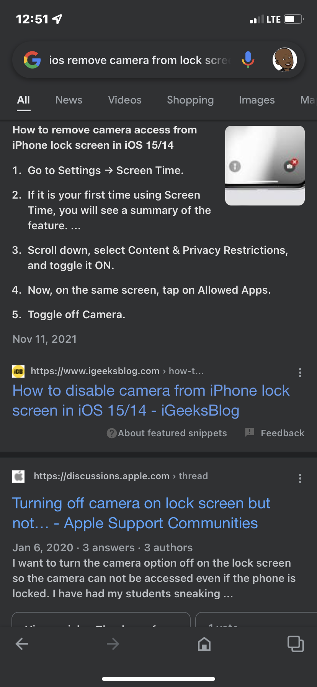
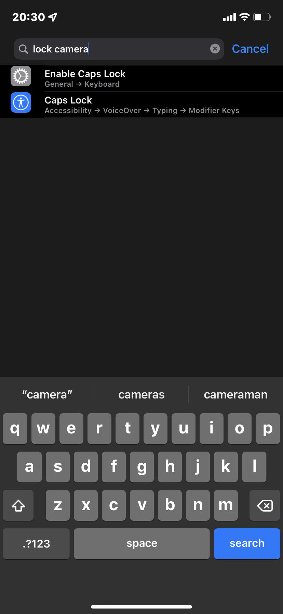
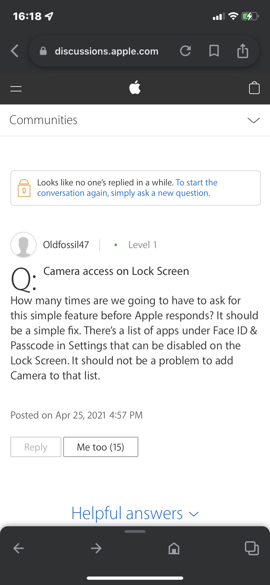

# "easy to use" value violation

Apple, in latter years, veers far·off its "easy to use" mantra  
– tasks that should·be easy to·perform on devices that you “own” instead are complicated, hard to·complete, or not allowed  
– Apple violates its own “easy to use” value, which it publicizes to no·end in ads and on its website:  
  
&nbsp;

removing the camera from the lock screen in iOS 15 is a complicated mess, which the Settings app makes more difficult than such a task should·be  
· actually, iOS 15 makes the task impossible  
· here is my story  

how do you hide the camera in the iOS lock screen?  
. this should be an easy task for any iPhone user  
. but, after failing to perform this task perusing the Settings app, i found this on the internet:  
  
. Screen Time!?  
. Screen Fucking Time!?  
. note that i used the fabulously useless search field:  
  
– why the fuck do i have to do an internet search to find out how to perform essential tasks on my iPhone?  
– again, Screen Fucking Time!?  
· this is why people get frustrated with their “surprising and delightful” devices  
– and, what i just did makes the camera inaccessible in the entire device  
· i cannot take pictures now  
· the fuck is wrong with that company these days?  
· it used to be fucking great!  
· it. used. to. be. great.  
· but it no longer is great  
· it is merely good  
– Apple keeps yelling to the world that its core competency is user experience  
· well, it sucks at it  
– there may be a way to hide the camera from the lock screen WHILE REMAINING AVAILABLE ON THE HOME SCREEN  
· but i could not figure it out with the Settings app  
· if there is a way to do what i want to do, it is not even indexed in the apps search facilities  
– after i turned·off Content & Privacy Restrictions on my phones Screen Time settings, i got this beauty on my Mac:  
  
· what they fuck is that?  
· that messaging is totally incongruent with what i did  
· this is why people ignore dialog boxes; they are totally stupid  
· a “smart” ecosystem would understand the meaning and intent of my interactions and not waste my motherfucking time with shit like this  
· the message also appeared on my iPad   
· luckily im no longer using my Apple Watch; what would that message look like there?  
– a 3 billion USD company must do better than extracting every cent possible from people while providing user experiences that are not compatible with the expense they incur in contributing to the companys exorbitant profits  
· if this is the best possible user experience, we deserve way better  
&nbsp;
a community ignored  
– apparently Apple is well aware of peoples desire to get the camera out of the lock screen  
· but Apple ignores it:  
  
&nbsp;

