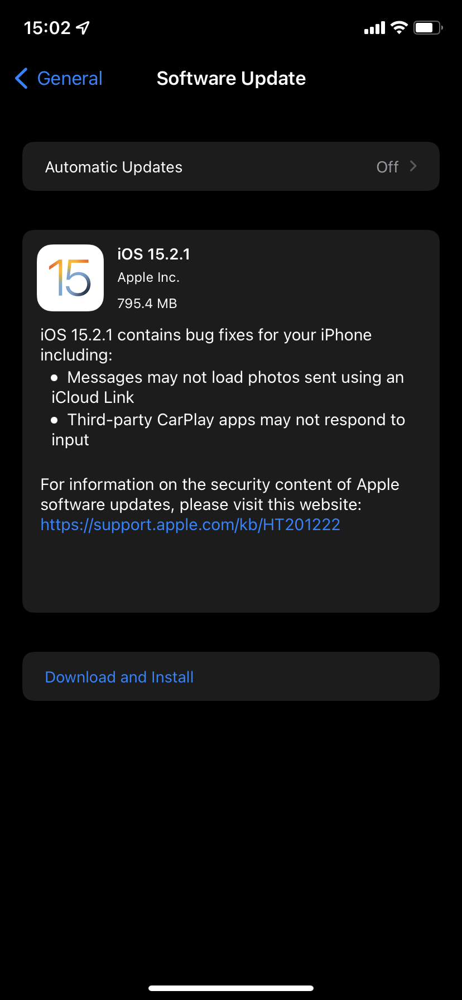

# breaking the functionality of third·party software

i use the Waze app for navigation  
– in the past few weeks i experienced problems using Waze thru CarPlay in my car while driving, which is very inconvenient, almost unsafe  
· i tweeted about this  
· i experienced similar problems with Spotify  
· today i see that iOS 15.2.1 is supposed to fix this serious problem  

i mistrust Apple competence, quality_assurance, and concern for the customer   
· this is why i have Automatic Updates off: i dont know what essential functionality a software_update from Apple is liable to·break  
· i made the mistake of updating to iOS 15.2  
· i should·have waited for this maintenance release  
  
